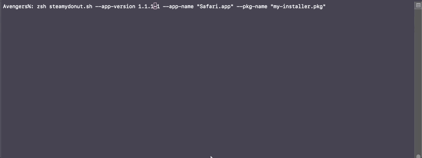

# Steamy Donut

Easily install packaged apps without installing over a newer version. This project will start with installing `.pkg` installers, but will grow to handle `.dmg` and other methods of installing macOS apps.

**NOTE**: THE CONTENTS OF THIS REPO ARE A WORK IN PROGRESS ...


## Usage

```
usage: steamydonut.sh [-h] --app-name --app-version --package-name [--version]

Install packaged apps without accidently overwriting a newer version that may already be installed.

arguments:
    --app-name        Application name. This should be how the app name appears in the /Applications 
                      folder or wherever the app is installed. If the app name contains spaces make 
                      sure to it in double quotes ("").
                      Examples: "Microsoft Teams.app", Atom.app, or "Google Chrome.app"

    --app-version     Version of app being installed. The version number should be of the format X.X.X.X.
                      Examples: 1 or 1.1 or 1.1.1-1

    --pkg-name        Name of package installer (your-installer.pkg).

    --path            Path to installer. If a path is not provided it is assumed that the installer file 
                      is in the current working directory.

    --version         Print current version of steamydonut.sh

    -h, --help        Print this help message.
```


## Examples

### Older Package Version




##   TODO:

✅ - Turn this tool into a command line Utility  
🔲 - handle .dmg installs  
🔲 - Add builtin downloads for common apps
