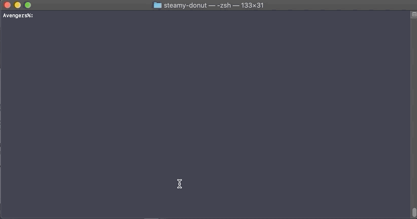

# Steamy Donut

&nbsp;
&nbsp;
&nbsp;
&nbsp;

<p align=center>
<b>NOTE</b>: THE CONTENTS OF THIS REPO ARE A WORK IN PROGRESS ... PLEASE TEST IN YOUR ENVIRONMENT BEFORE PUTTING INTO PRODUCTION ☺️
</p>

Easily download and install software that is available directly from the internet. (Examples: Google Chrome Browser, FireFox, Microsoft Office Suite)


## Usage

```
usage: steamydonut.zsh [-h] [--donut-menu] [--donut-recipe <keyword>] [--order-donut <keyword>] [--version]

Easily install locally packaged apps without installing over a newer version, or download and install publicly
avaialble apps directly from the internet.
arguments:
      --donut-menu            See a list of apps available for internet download.
      --donut-recipe          See more info about a particular app.
      --order-donut           Download and install specified app from the internet. For example, to download and
                              install the latest version of Google Chrome use the following flag and app keyword:

                                  steamydonut.zsh --order-donut googlechrome

      --version               Print current version of steamydonut.zsh
      -h, --help              Print this help message.

examples:
```


## Examples


### List Donuts




##   TODO:

✅ - Turn this tool into a command line Utility  
🔲 - handle .dmg installs  
🔲 - Make the menu dynamic
🔲 - Add builtin internet installers for common apps
